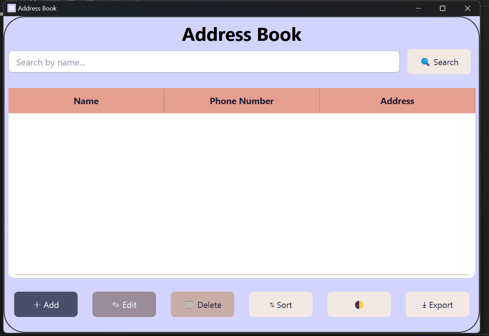

# 📒 Address Book Application

**A modern, user-friendly Address Book desktop application built with C++ and the Qt Framework.**

---

## 📌 About the Project

The Address Book Application helps users easily manage their contact information in a simple, efficient, and visually clean way.  
It supports core operations like **Add, Edit, Delete, Search, Sort, and Export**, all handled through an intuitive GUI.

---

## ✨ Features

✅ Add, edit, and delete contacts  
✅ Fast search with hash table implementation  
✅ Sort contacts alphabetically  
✅ Export contacts to `.csv` for backup or sharing  
✅ User-friendly **Graphical User Interface** with light/dark mode  
✅ Built with **C++** and the **Qt Framework**

---

## ⚙️ Technologies Used

- **C++** (OOP, STL)
- **Qt Framework** (Widgets, Designer)
- **Qt Creator IDE**
- **Git & GitHub** for version control

---

## 📂 Project Structure

```plaintext
AddressBook/
├── Forms/
│   └── mainwindow.ui       # GUI layout
├── src/
│   ├── mainwindow.cpp      # Main logic
│   ├── mainwindow.h
│   ├── editcontactdialog.cpp
│   ├── editcontactdialog.h
│   ├── phonenumberdialog.cpp
│   ├── phonenumberdialog.h
├── icon.jpg                # App icon
├── CMakeLists.txt          # Build instructions
├── .gitignore              # Ignored files
└── README.md               # Project documentation
```

🚀 Getting Started

📥 Prerequisites

Qt 5/6 installed

Qt Creator IDE

C++17 or higher

Compatible OS: Windows 10 or higher


⚡ Build & Run

1️⃣ Clone this repository:

git clone https://github.com/KhushiGupta113/AddressBook.git

2️⃣ Open the project in Qt Creator
3️⃣ Configure & build the project
4️⃣ Run the application!

📸 Screenshots
### 🖥️ Main Window


🙌 Learnings


This project helped reinforce:

Practical C++ OOP design

Data Structures & Algorithms for real use cases

Qt signals & slots, event-driven programming

File handling for persistent storage

Version control & collaboration using Git and GitHub
